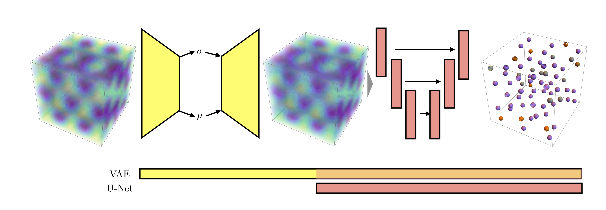
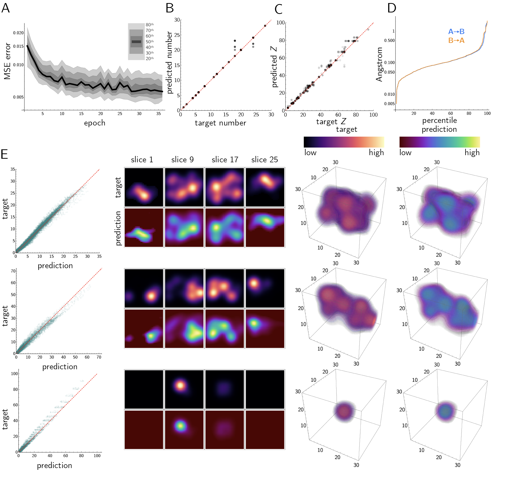
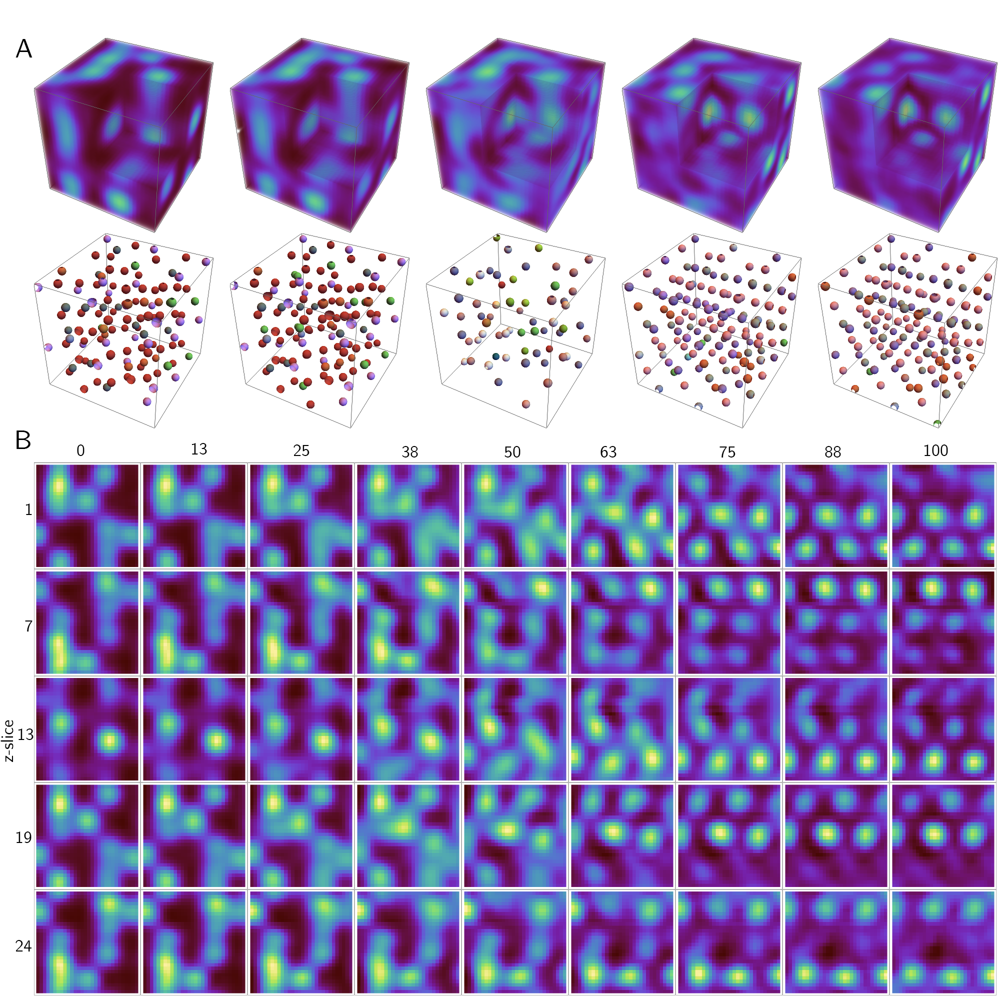

# Data-Driven Approach to Encoding and Decoding 3-D Crystal Structures
This is the code accompanying [Data-Driven Approach to Encoding and Decoding 3-D Crystal Structures](https://arxiv.org/abs/1909.00949).

[Jordan Hoffmann](https://jhoffmann.org/), Louis Maestrati, Yoshihide Sawada, [Jian Tang](https://jian-tang.com),
Jean Michel Sellier, and [Yoshua Bengio](https://mila.quebec/en/yoshua-bengio/)

Click on the image below to see a video highlighting some of the results.
[](https://www.youtube.com/watch?v=ZpFN5tSo5Pg)

# Code
There are two types of code in this repository, each detailed below.
The code is written using `pytorch`. For data generation, we use `mpi4py`. For trianing, we used `Tesla V100` [16 GB].
Requirements:
```bash
python 3.7
pytorch 1.1.0
pymatgen
mpi4py // Can easily be omitted.
```

## Data Availability
For now, please email me  at`echo ude.dravrah.g@nnamffohj|rev`.


## Data Generation
Use `generate.py` and `generate_unit.py` for generating repeating lattices and unit cell representations. 
We use the library mpi4py to compute these representations in parallel. The input should be a list of files
in `.cif` format. 
```bash
> mpiexec -n 32 python generate.py
```


## Crystal-VAE 
```bash
> python main.py --lr 0.0000001 --epochs 100
```

# Citation
If you use the code or the paper, please cite:
```
@article{hoffmann2019data,
  title={Data-Driven Approach to Encoding and Decoding 3-D Crystal Structures},
  author={Hoffmann, Jordan and Maestrati, Louis and Sawada, Yoshihide and Tang, Jian and Sellier, Jean Michel and Bengio, Yoshua},
  journal={arXiv preprint arXiv:1909.00949},
  year={2019}
}
```


# Article Description
[](https://www.youtube.com/watch?v=3qVVew7-DgQ)
In this article, we encode and decode 3-D crystal structures. We use a variational autoencode 
and a U-Net segmentation model to (1) encode and decode a density field representing the locations
and species of atoms in a crystal and (2) segment the decoded density field into different atomic species.

By coupling these two tasks, we are able to very accurately encode and decode our representations of crystals.

We consider two representations of crystals: in the first, we consider a single unit cell. In the second, we consider
repeating unit cells that can have over 200 different atoms to encode and decode. We use the same network for both approaches.
Using the latent space vectors, we can interpolate between different molecules in both frameworks as shown in the following videos:

[](https://www.youtube.com/watch?v=3yPVdgd2mQ0)
[](https://www.youtube.com/watch?v=q2d8LZq8RW4)
[](https://www.youtube.com/watch?v=pxYb8cnLxio)
[](https://www.youtube.com/watch?v=U5-x3jL2zcc)



